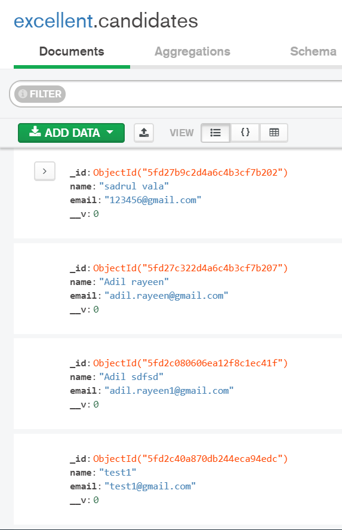
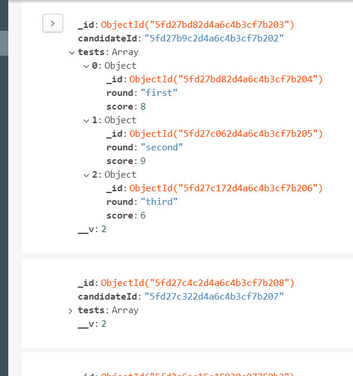
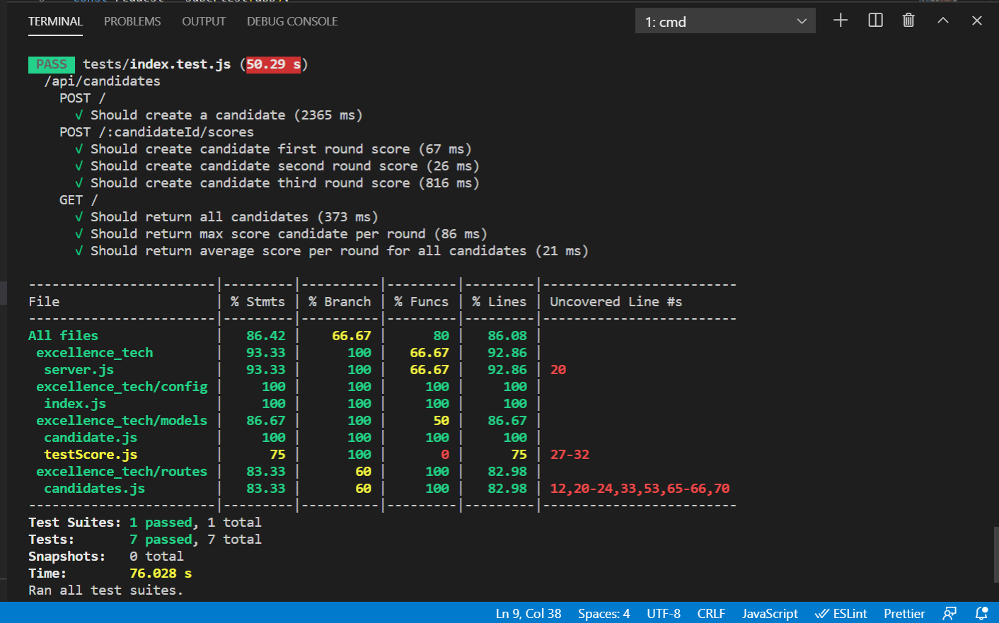

# excellence-tech-test project

This project is used to register the candidates and when candidates perform any test for any round then we store their test results. We can get few reportings over the data like-
1. Find maximum scoring candidate per round
2. Find average scores per round

## Data model used
1. candidates

- id (string) unique
- name (string)
- email (string) unique

2. testScores

- candidateId (string) unique
- tests (array of objects)
    - test (object)
        - round (string)
        - score (number, min: 0, max: 10)


### Candidate Entity





### TestScore Entity





## How to run the project

### Prerequesite
- OS: Windows/Mac/Linux
- Node js version > 10 installed
- Mongo DB installed


### How to build
cmd> cd /{project root path}


cmd> npm install

### How to run
cmd> node server.js

Now the localhost will be up and running on http://localhost:3000

#### POSTMAN API's:
Collection Link: 

#### API's:
1. POST /candidates - To create the candidate
```
payload: {
    "name": "sadrul",
    "email": "sadrul.rayeen@gmail.com"
}
```
2. POST /candidates/:candidateId/scores - To create score of a candidate
```
payload: {
    round: "first",
    score: 10
}
```
3. GET /candidates/scores?round=first&limit=1 - To get the maximum scoring candidate per round
4. GET /candidates/scores/average?round=first - To get the average score per round


## Unit test cases

#### How to execute
cmd> /{root of the project}


cmd> npm test

#### Test case report


